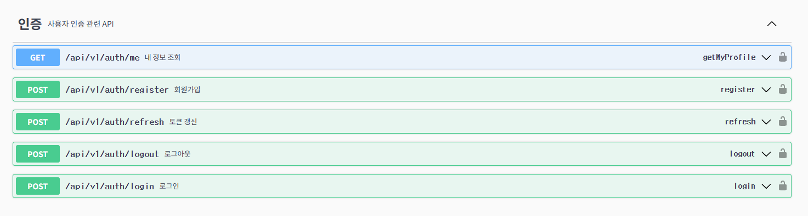
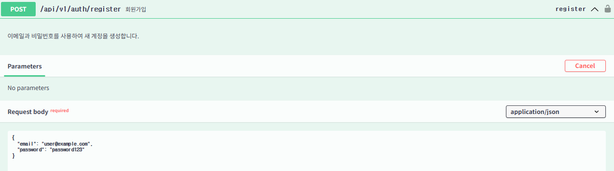
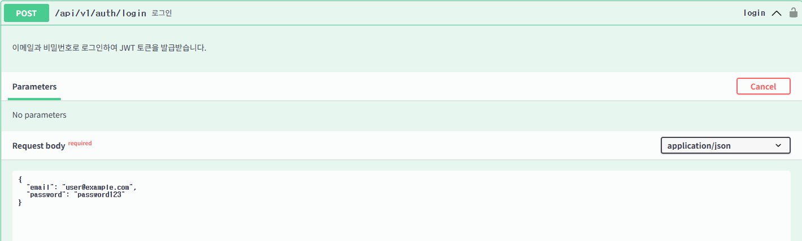
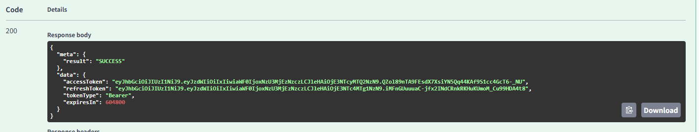
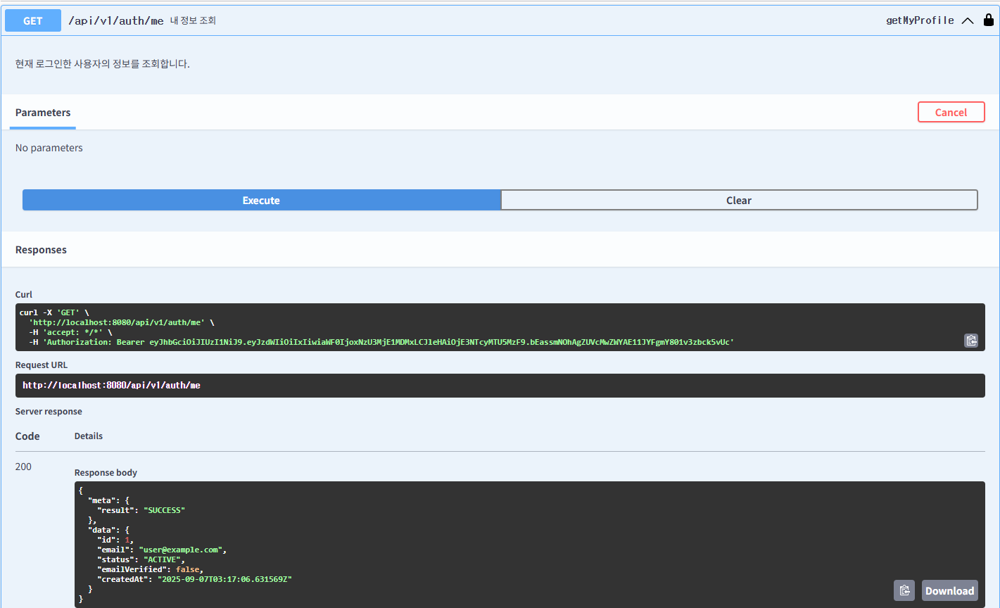
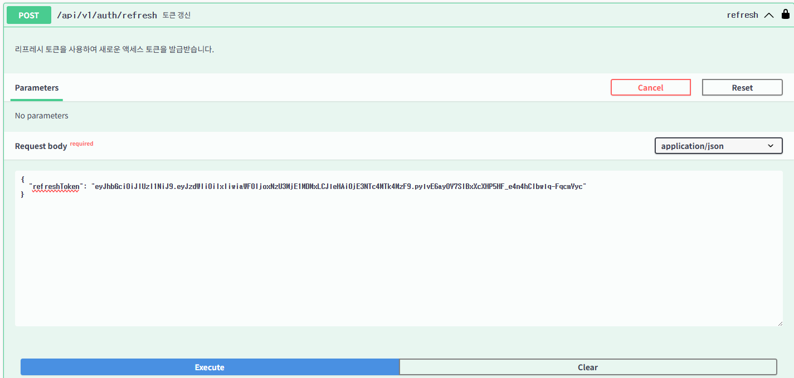
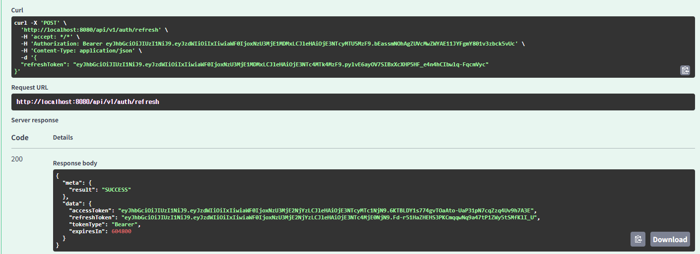
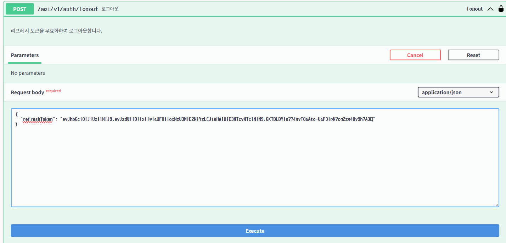
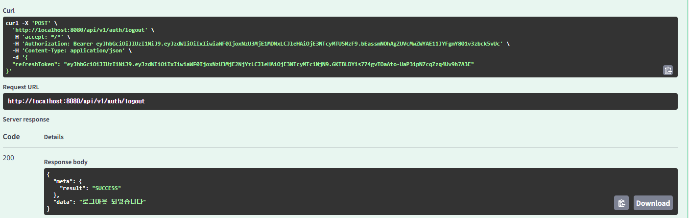

# NSUS Lab Authentication System

**확장 가능하고 보안성이 강화된 JWT 기반 인증 시스템**

## 프로젝트 개요

본 프로젝트는 JWT 기반 인증 시스템을 구현하였습니다.
멀티모듈 및 DDD 아키텍처와 Redis 캐싱을 통해 높은 성능과 확장성을 제공하며, 다층 보안 전략으로 안전한 사용자 인증을 보장합니다.

### 주요 기능
- **이메일 기반 회원가입/로그인**
- **JWT Access Token + Refresh Token 인증**  
- **Redis-First, DB-Fallback 캐싱 전략**
- **Rate Limiting 및 계정 보안 정책**
- **구조화된 API 응답 및 에러 처리**
- **Docker 기반 개발/배포 환경**

### 기술 스택
- **Backend**: Java 21, Spring Boot 3.2, Spring Security
- **Database**: MySQL 8.0, Redis 7
- **Build**: Gradle Multi-Module
- **API**: RESTful API, Swagger/OpenAPI 3.0
- **Infrastructure**: Docker, Docker Compose
- **Security**: JWT, BCrypt, AOP Rate Limiting

###  [설계 의도 및 기술 선택 이유 상세 문서](docs/DESIGN_DECISIONS.md)


## 실행 방법

### 1. 인프라 실행 (MySQL + Redis)
```bash
docker-compose -f docker/docker-compose.yml up -d
```

### 2. 애플리케이션 실행
```bash
./gradlew :app:api:bootRun
```

### 3. API 테스트
- **Swagger UI**: http://localhost:8080/swagger-ui.html
- **Health Check**: http://localhost:8080/actuator/health

### 환경 정보
- **MySQL**: localhost:3308 (nsuslab/password123)
- **Redis**: localhost:6381 (password123)

## 프로젝트 구조
본 프로젝트는 멀티 모듈 프로젝트로 구성되어 있습니다. 각 모듈의 위계 및 역할을 분명히 하고, 아래와 같은 규칙을 적용합니다.

```
Root
├── app ( spring-applications )
│   └── 📦 api
├── modules ( reusable-configurations )
│   └── 📦 jpa
│   └── 📦 redis
│   └── 📦 jwt
└── supports ( add-ons )
    ├── 📦 jackson
    └── 📦 logging
```

## API 명세

Swagger UI: `http://localhost:8080/swagger-ui/index.html`

<details>
<summary> 전체 API</summary>



</details>


<details>
<summary> 회원 가입 API</summary>



</details>

<details>
<summary> 로그인 API</summary>



</details>

<details>
<summary>로그인 성공 시 토큰 발급 </summary>



</details>

<details>
<summary> 회원 정보 조회 (토큰 필요) </summary>



</details>

<details>
<summary> 토큰 재발급 API </summary>


</details>

<details>
<summary> 토큰 재발급 성공 시 </summary>


</details>


<details>
<summary> 로그아웃 API </summary>


</details>

<details>
<summary> 로그아웃 성공 시 </summary>


</details>


### 에러코드
| ErrorType           | HTTP Status       | 설명         |
|---------------------|-------------------|------------|
| DUPLICATE_EMAIL     | BAD_REQUEST       | 이메일 중복     |
| USER_NOT_FOUND      | BAD_REQUEST       | 사용자 없음     |
| INVALID_CREDENTIALS | BAD_REQUEST       | 잘못된 인증 정보  |
| INVALID_TOKEN       | BAD_REQUEST       | 유효하지 않은 토큰 |
| UNAUTHORIZED        | UNAUTHORIZED      | 인증 실패      |
| ACCOUNT_LOCKED      | CONFLICT          | 계정 잠김      |
| TOO_MANY_REQUESTS   | TOO_MANY_REQUESTS | Rate Limit |


## ERD
### [>> ERD 설계 파일 바로가기](docs/erd.md)


