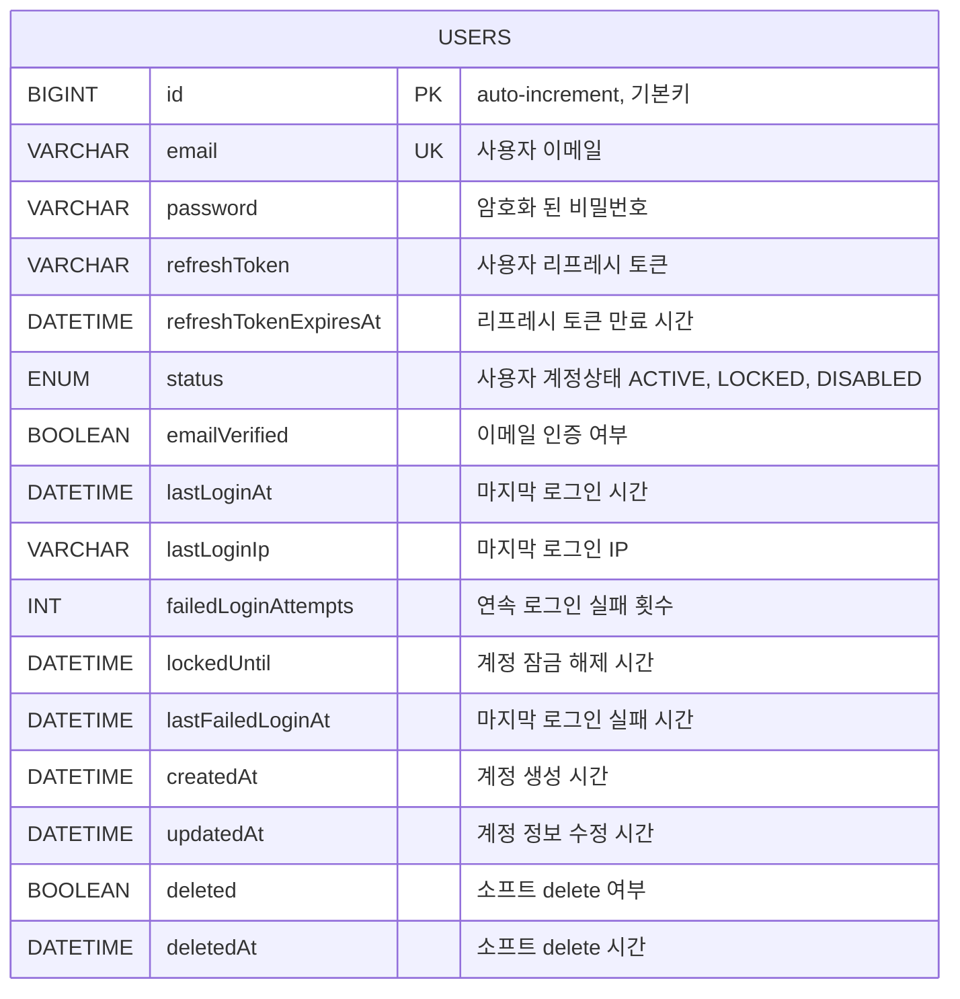

# Entity Relationship Diagram

## User Entity

```mermaid
erDiagram
    USERS {
        BIGINT id PK "auto-increment, 기본키"
        VARCHAR email UK "사용자 이메일"
        VARCHAR password "암호화 된 비밀번호" 
        VARCHAR refreshToken "사용자 리프레시 토큰"
        DATETIME refreshTokenExpiresAt "리프레시 토큰 만료 시간"
        ENUM status "사용자 계정상태 ACTIVE, LOCKED, DISABLED"
        BOOLEAN emailVerified "이메일 인증 여부"
        DATETIME lastLoginAt "마지막 로그인 시간"
        VARCHAR lastLoginIp "마지막 로그인 IP"
        INT failedLoginAttempts "연속 로그인 실패 횟수"
        DATETIME lockedUntil "계정 잠금 해제 시간"
        DATETIME lastFailedLoginAt "마지막 로그인 실패 시간"
        DATETIME createdAt "계정 생성 시간"
        DATETIME updatedAt "계정 정보 수정 시간"
        BOOLEAN deleted "소프트 delete 여부"
        DATETIME deletedAt "소프트 delete 시간"
    }
```

### Indexes
- `idx_email` on `email`
- `idx_refresh_token` on `refreshToken`
